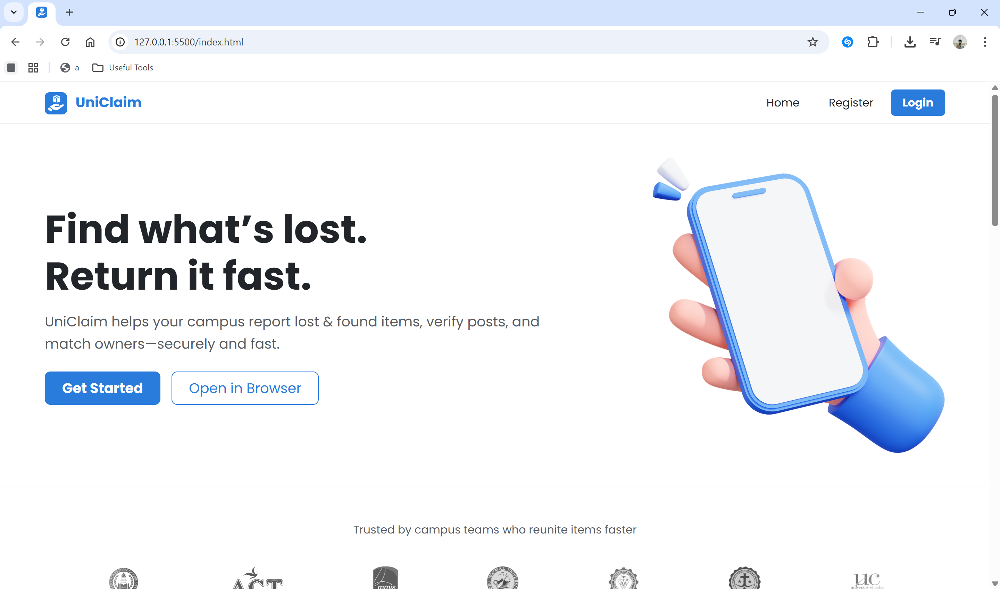
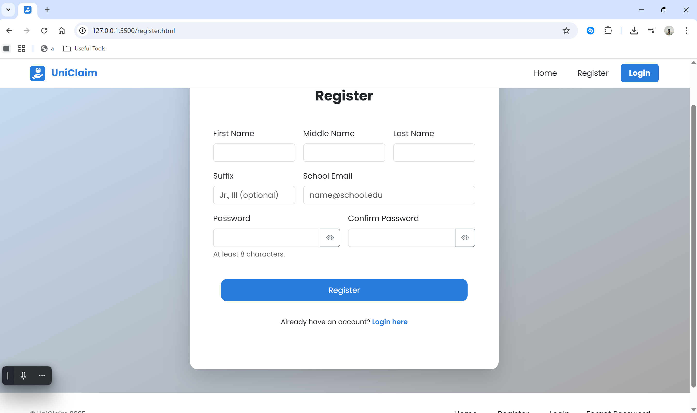
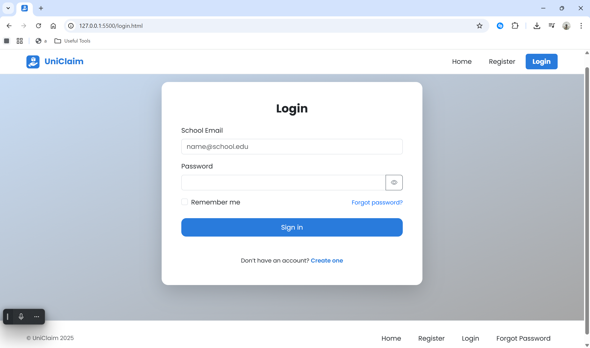
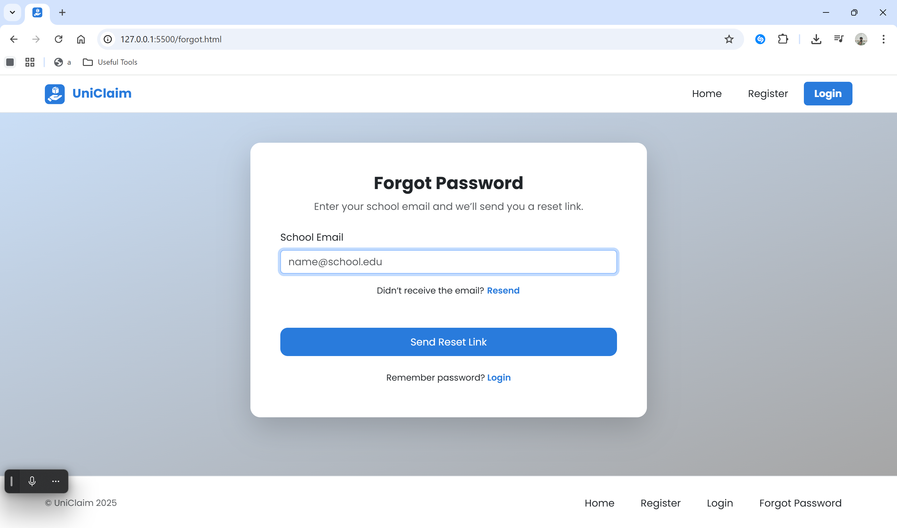

# UniClaim — Bootstrap Layout (Lab 2.7)
Responsive Bootstrap 5 layouts for **Homepage**, **Registration**, **Login**, and **Forgot Password**, based on the UniClaim (Lost & Found) FRD.

UniClaim is a school-based Lost & Found tracker that streamlines reporting, verification, matching, and return of items. Registered users submit Lost/Found posts with details and photos; admins approve to keep the feed clean, use a match dialog to link related posts, notify owners/finders, track custody, and mark items Pending → Approved → Matched → Resolved. Guests can browse a read-only feed. The app includes role-aware pages—Dashboard, Reports, Items in Custody, Notifications, and Profile/Settings—and is built with a responsive, accessible Bootstrap UI to move cases from “lost” to “returned” fast.

## Pages
- `index.html` — Navbar, hero, features grid, footer
- `register.html` — Registration form (First, Middle, Last, Suffix, Email, Password, Confirm Password)
- `login.html` — Login form with Remember me and link to Forgot Password
- `forgot.html` — Email field and submit button

## Tech
- Bootstrap 5 via CDN
- Organized assets folder (`assets/css/style.css`, `assets/img/`, `assets/anim/`, `assets/screenshots/`)

## Group Members
- Vicente Miguel N. Alcala
- Grachelle Mae A. Carmelotes
- Edmar Angelo S. Generoso

## Screenshots
| Page            | Screenshot                            |
| --------------- | ------------------------------------- |
| Home            |     |
| Register        |  |
| Login           |        |
| Forgot Password |      |

## Live Demo
https://bisentey.github.io/uniclaim-frontend/
